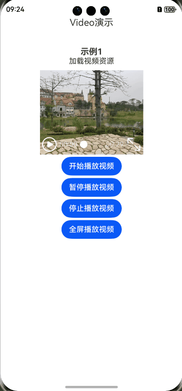

# 实现播放视频功能
## 介绍
本示例基于Video组件实现了播放视频功能，包括开始播放、暂停播放、停止播放、全屏播放。
## 效果预览


## 约束与限制
1. 本示例支持HarmonyOS 5.0.1 Release SDK及以上版本。
2. 本示例需要使用DevEco Studio 5.0.1 Release及以上版本进行编译运行。
3. 本示例支持设备：系统为HarmonyOS 5.0.1 Release及以上版本的华为手机。
## 使用说明
点击按钮可控制视频播放，其中点击暂停播放，视频会停在播放到的秒数，点击停止播放，视频回退到0秒。
## 实现思路
首先在本地rawfile目录指定视频文件，再使用资源访问符$rawfile()引用视频资源。通过VideoController控制视频播放，调用start接口开始播放视频；调用pause接口暂停播放视频，再次播放时从当前位置继续播放；调用stop接口停止播放视频，再次播放时从头开始播放；通过将requestFullscreen接口的value设为true实现视频全屏播放。核心代码如下。
```javascript
Video({
            src: $rawfile('videoTest.mp4'),
            previewUri: $rawfile('PixPin_2024-10-09_19-58-52.png'),
            controller: this.controller
          })
            .width(220)
            .height(180)
          Button('开始播放视频')
            .onClick(() => {
              this.controller.start()
            })
          Button('暂停播放视频')
            .onClick(() => {
              this.controller.pause()
            })
          Button('停止播放视频')
            .onClick(() => {
              this.controller.stop()
            })
          Button('全屏播放视频')
            .onClick(() => {
              this.controller.requestFullscreen(true)
            })
```
## 工程目录
```
entry/src/main/ets/
|---entryability
|   |---EntryAbility.ets
|---common
|   |---CommonTitle.ets        
|---pages
|   |---Index.ets              // 主页
```
## 模块依赖
无
## 参考文档
[Video](https://developer.huawei.com/consumer/cn/doc/harmonyos-references-V5/ts-media-components-video-V5)
